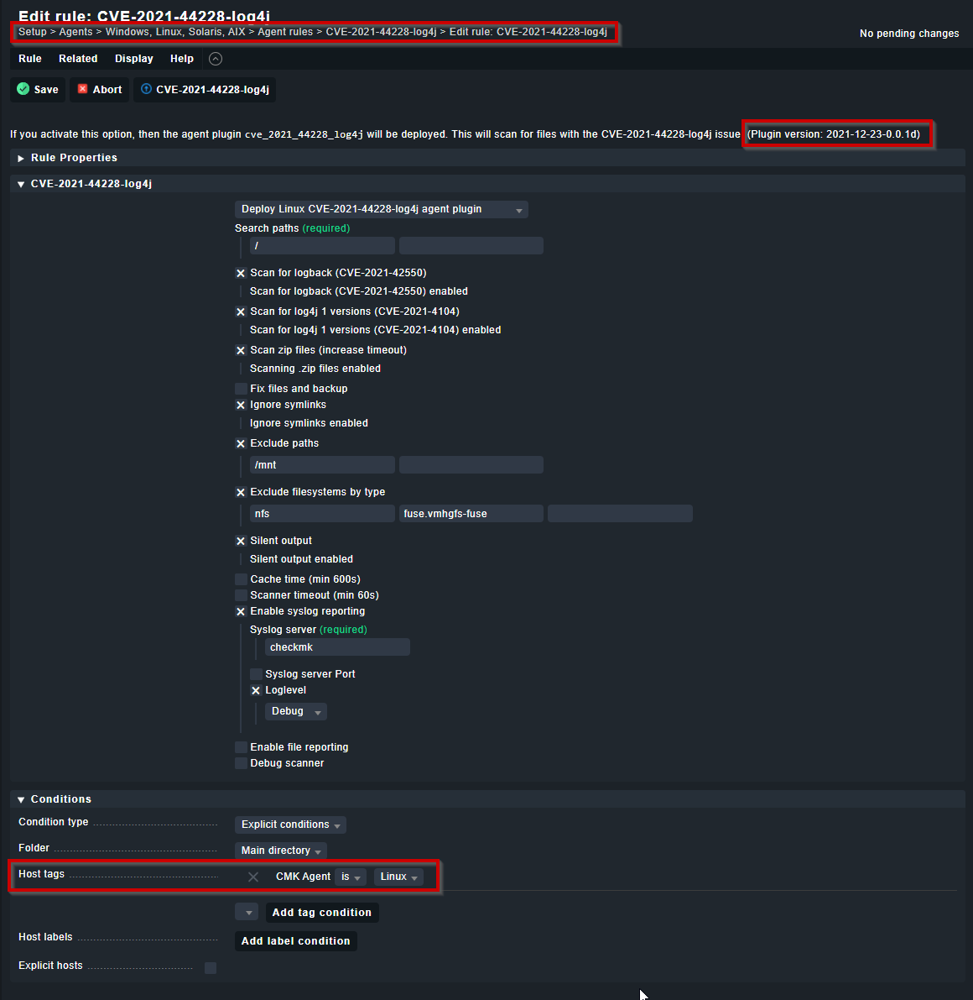
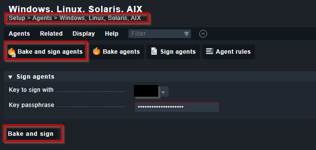
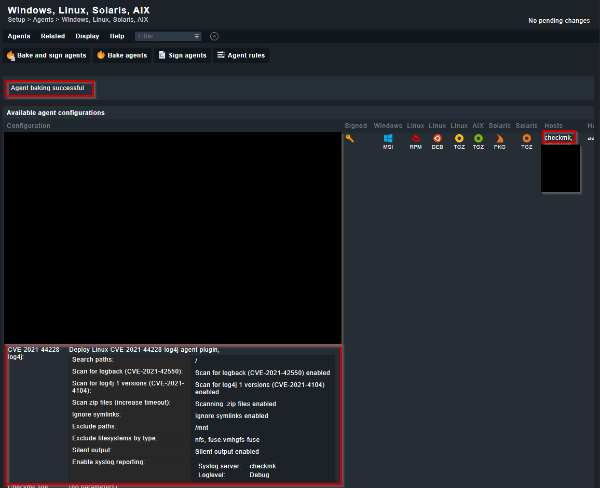
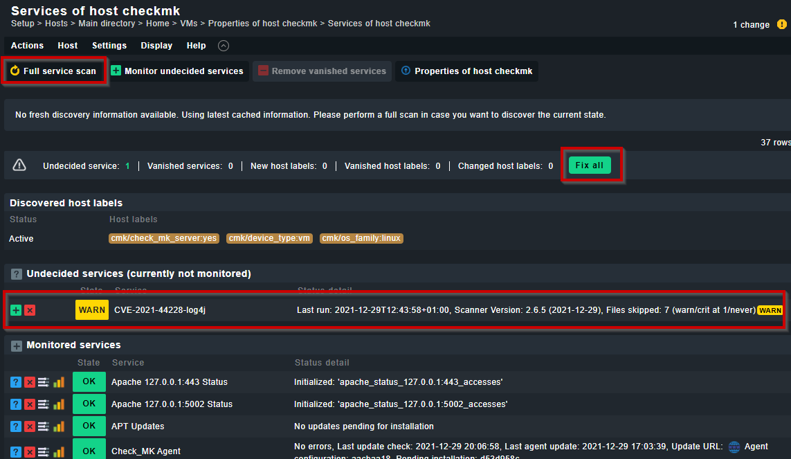
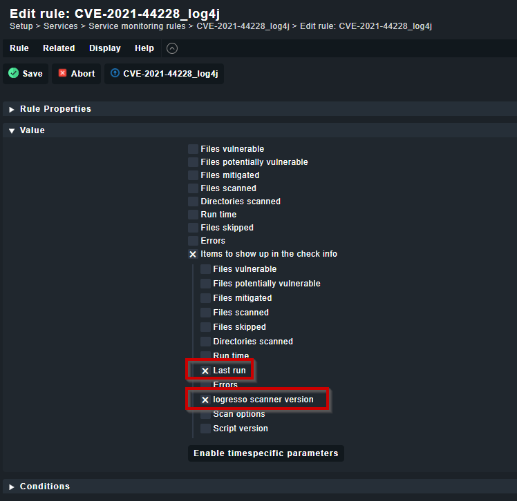

# This is about how to use the CVE-2021_44228-log4j plugin 

This how to focuses on the RAW edition and on troubleshooting the plugin. For the Enterprise/Free edition you can do all the work via the bakery/automaic agent update.

If you have any issue with this plugin read this how to especally the **_If it doesn't work_** section. If this not help please have a look at the [contribution guidelines](CONTRIBUTING.md "Contributing") this will make helping you a lot easier.

<details><summary>Linux and Windows</summary>

To use this plugin with the RAW edition of CMK you need to copy the following files from the directory `~/local/share/check_mk/agents/plugins` of your CMK site to the client systems.

| OS| What | File | To |
|-----| ------ | ------ | ------ |
|Windows| scanner | `log4j2-scan.windows` | `"C:\ProgramData\checkmk\agent\bin\log4j2-scan.exe"` |
|| script | `cve_2021_44228_log4j.windows` | `"C:\ProgramData\checkmk\agent\plugins\cve_2021_44228_log4j.ps1"` |
|| config | `cve_2021_44228_log4j.cfg.windows` | `"C:\ProgramData\checkmk\agent\config\cve_2021_44228_log4j.cfg"` |
|Linux| scanner |  `log4j2-scan.linux` | `/usr/lib/check_mk_agent/bin/log4j2-scan` |
|| script | `cve_2021_44228_log4j.linux` | `/usr/lib/check_mk_agent/plugins/86400/cve_2021_44228_log4j.sh` |
|| config | `cve_2021_44228_log4j.cdg.linux` | `/etc/check_mk/cve_2021_44228_log4j.cfg` |
|AIX| scanner | `log4j2-scan.aix` | `/usr/lib/check_mk_agent/plugins/86400/log4j2-scan` |
|| script | `your_cmk_agent_plugin.aix` | `/usr/lib/check_mk_agent/plugins/86400/your_cmk_agent_plugin` |
|Solaris| scanner | `log4j2-scan.solaris` | `/usr/lib/check_mk_agent/plugins/86400/log4j2-scan` |
|| script | `your_cmk_agent_plugin.solaris` | `/usr/lib/check_mk_agent/plugins/86400/your_cmk_agent_plugin` |

**Note**: AIX and Solaris are not included yet included in this package.

Don't forget to make the Linux (AIX/Solaris) files executable (`chmod a+x log4j2-scan` and `chmod a+x CVE-2021-44228_log4j.sh`).

For the RAW edition you need to configure the caching for the Windows plugin in the file _`C:\ProgramData\checkmk\agent\check_mk.user.yml`_ (not tested). 

```
plugins:
  enabled: true
  execution:
    - async: true
      cache_age: 86400
      pattern: $CUSTOM_PLUGINS_PATH$\cve_2021_44228_log4j.ps1
      run: true
      timeout: 600
```
</details>

<details><summary>Using a specific version of the scanner</summary>

Included with this package are the scanner files for Linux and Windows in version 2.5.3 (2021-12-22). As the development of the scanner is still moving veriy fast forward, I will update the package from time to time. If you want to use a specific version of the scanner just put the files to `~/local/share/check_mk/agents/plugins` of your CMK site and redeploy the agent (bakery).

 | OS | From | To |
| ------ | ------ | ------ |
| Windows | `log4j2-scan.exe` | `log4j2-scan.windows` |
| Linux |  `log4j2-scan` | `log4j2-scan.linux` |

At the time of writing this, I am testing with version 2.5.3 and 2.6.1 is already available.
</details>


<details><summary>Hints for other platforms (not Linux/Windows)</summary>

For other platforms you need
1. the scanner from logpresso [logpresso CVE-2021-44228-Scanner Releases](https://github.com/logpresso/CVE-2021-44228-Scanner/releases) (Check that it run's on your destination platform)
1. you need a script as plugin for the check_mk_agent of your platform that executes the scanner and outputs the nessary information for CMK.

### AIX/Solaris
For AIX and Solaris you can put the the files in the places like in the table above and use the bakery to greate the agent package and for the rollout.

### BSD/UNIX/MacOS
On BSD/UNIX/MacOS the plugin for the check_mak_agent goes mostly in the `/usr/lib/check_mk_agent/plugins/` (`$PLUGINSDIR`) directory. The scanner can be put under `/usr/lib/check_mk_agent/bin/`.

On this platforms is only a very basic check_mk_agent available, so you need to implement the caching for the agent plugin your self :-(. If you don't do this the scanner will run with every cycle of the check_mk_agent (once per minute in the default settings)

How can you do that?

- have a directory where the plugin can create a chache file. E.g. `/var/lib/check_mk_agent/cache/` (`$MK_MK_VARDIR`)
- on the first run put the output from the plugin in this directory. E.g. `cve_2021_44228_log4j.cache`
- on every run check if this file exist and if so is it older than your intended scann intervall (E.g. one day - 86400 second)
- if the cache file doesn't exist or is to old rerun the scanner, else just output the cache file
</details>

<details><summary>The agent plugin script</summary>
The agent plugin is a basic shell script that reads the sanner options from the config file, runs the scanner and outputs the results for CMK. Here is the script for Linux as example.

```
#!/bin/bash
#
# Author: thl-cmk[at]outlook[dot]com
# URL   : https://thl-cmk.hopto.org
# Date  : 2021-12-18
#
# Wrapper around: https://github.com/logpresso/CVE-2021-44228-Scanner
#
# plugin for the check_mk linux agent
#
# 2021-12-21: fixed exit code other than 0 (THX to cmasopust[at]greentube[dot]com)
# 2021-12-24: fixed spaces in file names (https://stackoverflow.com/questions/19122448/bash-escaping-spaces-in-filename-in-variable)

SCRIPTVERSION="2021-12-24-0.0.1d"
OPTIONS="/"
EXECUTABLE=/usr/lib/check_mk_agent/bin/log4j2-scan
PLUGIN_CONF_DIR="/etc/check_mk"


if [ -f $MK_CONFDIR/cve_2021_44228_log4j.cfg ]; then
    . $MK_CONFDIR/cve_2021_44228_log4j.cfg 2>/dev/null
elif [ -f $PLUGIN_CONF_DIR/cve_2021_44228_log4j.cfg ]; then
    . $PLUGIN_CONF_DIR/cve_2021_44228_log4j.cfg 2>/dev/null
fi

echo "<<<cve_2021_44228_log4j:sep(0)>>>"
# 2021-12-19T22:08:52+01:00
date +%FT%T%:z
printf "SCAN OPTIONS: "
printf " %s " "${OPTIONS[@]}"
printf "\n"
printf "SCRIPT VERSION: %s\n" "$SCRIPTVERSION"
printf "%s\n" "----------------------------------------------------"

if [ -f $EXECUTABLE ]; then
    $EXECUTABLE "${OPTIONS[@]}"
else
  printf "ERROR: Executable not found: %s\n" "$EXECUTABLE"
fi

exit 0

```

The important lines (for the check plugin to work) are:

- `echo "<<<cve_2021_44228_log4j:sep(0)>>>"` this connets the agent output with the check plugin
- `date +%FT%T%:z` the date/time when the scanner starts, the check plugin will expect this to be the first line of output
- `echo "SCAN OPTIONS: $OPTIONS"` the options the scanner runs with, the check plugin expects this to start with `SCAN OPTIONS: `
- `echo "SCRIPT VERSION: $SCRIPTVERSION"` the version of the script, the check plugin expects this to start with `SCRIPT VERSION: `
- `$EXECUTABLE $OPTIONS` finaly this runs the scanner
- `exit 0` reset the exit code from the scanner to 0, without this check_mk_agent might not accept the script output

**Note**: the format of the date output has to be in the form of _**2021-12-19T22:08:52+01:00**_

</details>

<details><summary>The config file for cve_44228_log4j agent plugin</summary>

The bakery creates the config file `cve_2021_44228_log4j.cfg` for the agent plugin. At the moment this holds only the options for the scanner.

Example config file for the Linux agent plugin
```
# Created by Check_MK Agent Bakery.
# This file is managed via WATO, do not edit manually or you
# lose your changes next time when you update the agent.

OPTIONS=(--exclude "/mnt" --exclude "/test with space" --exclude-fs nfs,fuse.vmhgfs-fuse --syslog-level debug --syslog-udp checkmk --scan-logback --scan-log4j1 --scan-zip --no-symlink --silent "/");

```

Example config file for the Windows agent plugin
```
# Created by Check_MK Agent Bakery.
# This file is managed via WATO, do not edit manually or you
# lose your changes next time when you update the agent.

OPTIONS=--all-drives --syslog-level debug --syslog-udp checkmk --report-dir "D:\Kannweg\reports" --report-json --scan-logback --scan-log4j1 --scan-zip --silent 

```


**Note**: as mentioned in the table on top there is a sample config for Linux and Windows available. In the sample you will find a short decription to all posible options (as with scanner version 2.5.3)

</details>

<details><summary>If it doesn't work</summary>

- check if the necessary files are there (see table on top) 
- under *NIX check if the files are executable
- look for leftovers from older versions and remove them (see next toppic)
- run the scaner manually
- run the plugin manually
- run the agent manually, (look for the plugin output starting with `<<<cve_2021_44228_log4j:sep(0)>>>`)
- clear the cache `sudo rm /var/lib/check_mk_agent/cache/*cve*`
- use only _Search Path_ / _Drives to scan_, try to exclude large volumes so the scan time comes down, if you are succesfull try aditional options step by step
- look at the `Completed in xx.xx seconds` and adjust the _Scanner timeout_ setting (the scanner needs much more time in the background, so double the time)
- if there are only `*.new` files in the chache directory for the cve_2021_44228_log4j plugin, then the scanner has not finished to scan the system, maybe the timeout is still to low.

Manual run of the Windows version of the pluguin (use a admin shell)
```
Microsoft Windows [Version 10.0.19042.1083]
(c) Microsoft Corporation. All rights reserved.

C:\>powershell.exe -NoLogo -NoProfile -ExecutionPolicy Bypass -File "C:\ProgramData\checkmk\agent\plugins\cve_2021_44228_log4j.ps1"
<<<cve_2021_44228_log4j:sep(0)>>>
2021-12-20T16:12:23+01:00
SCAN OPTIONS: --all-drives
Logpresso CVE-2021-44228 Vulnerability Scanner 2.3.1 (2021-12-19)
Scanning drives: C:\, D:\

Scanned 124575 directories and 472700 files
Found 0 vulnerable files
Found 0 potentially vulnerable files
Found 0 mitigated files
Completed in 36.59 seconds

C:\>
```

Manual run of the Linux version of the plugin
```
thl-cmk@checkmk:~$sudo  /usr/lib/check_mk_agent/plugins/86400/cve_2021_44228_log4j.sh
<<<cve_2021_44228_log4j:sep(0)>>>
2021-12-20T16:12:56+01:00
SCAN OPTIONS: /
Logpresso CVE-2021-44228 Vulnerability Scanner 2.3.1 (2021-12-19)
Scanning directory: / (without udev, tmpfs)

Scanned 5938 directories and 51489 files
Found 0 vulnerable files
Found 0 potentially vulnerable files
Found 0 mitigated files
Completed in 0.52 seconds
thl-cmk@checkmk:~$
```
</details>

<details><summary>Notes for updates from older versions/local check</summary>

Before you use the package please remove all older versions or the local checks related to this plugin.

Wehre to loock:

- the local checks directory `/usr/lib/check_mk_agent/local` and its subdirectories
- the plugin directory `/usr/lib/check_mk_agent/plugins` and its subdirectories
- the cache directory `/var/lib/check_mk_agent/cache` 
</details>


<details><summary>Use with the enterprise/free edition of CMK</summary>

This is a step by step walk through on how to use this package. I assume you have already configured the automatic update for the CMK agent and have done the initial rollout/registering of the agent on your client systems.

1. configure the agent plugin Rule CVE-2021-44228-log4j
2. bake the agent
3. update tha agent
4. rediscover the services of your systems
5. configure the rule CVE-2021-44228-log4j for the check plugin (optional) 
<details><summary>Agent plugin Rule CVE-2021-44228-log4j</summary>

First configure the agent plugin Rule **CVE-2021-44228-log4j**. Go to `Setup > Agents > Windows, Linux, Solaris, AIX > Agent rules > CVE-2021-44228-log4j`.

**Note**: Attach the rule to your client systems. For example by a host tag.

**Note**: in the Rule title you will find the version of the WATO plugin for this rule.



</details>

<details><summary>Bake the agent</summary>

If you have configured and activated the agent plugin rule, you ned to _bake_ the agent. Go to `Setup > Agents > Windows, Linux, Solaris, AIX` klick `Bake and sign agents`, **provide your signing key**, klick `Bake and sign`.



After successfully finishing the agent bakery you should find an entry corresponding to your agent rule like this.



</details>
<details><summary>Update the agent on the client systems</summary>

Wait for the automatic agent update to finish (in the default settings the agent will check one a hour for an update).
**Note**: you can speed this up by issuing the cli command `sudo cmk-update-agent -v` or on Windows in a Adminshell with `& "C:\Program Files (x86)\checkmk\service\check_mk_agent.exe"  updater`

You can check the update sataus under `Monitor > System > Agent update status`. after a succesfull update it should look like this.


</details>

<details><summary>Rediscover the services</summary>

Now you can rediscover the services on your client system (or wait for the automatic service discovery if you have a rule for that). If everything is working as expected, you should get a new service like this.



Now you can activate the changes and you are done.

</details>

<details><summary>Configure the rule CVE-2021-44228-log4j for the check plugin (optional)</summary>

If you like you can configure most of the levels for the check plugin and the items on the short service output. By default there will be only _**Files vulnerable**_ and _**Files potentially vulnerable**_ show up, also all items that raise a warning or critical will show up on the short output. To do so go to `Setup > Services > Service monitoring rules > CVE-2021-44228_log4j` (under `Operating System Resources`) and configure the check plugin to your likings. For example to show the Last run and the version of the scanner



Then you get this output


</details>

</details>

