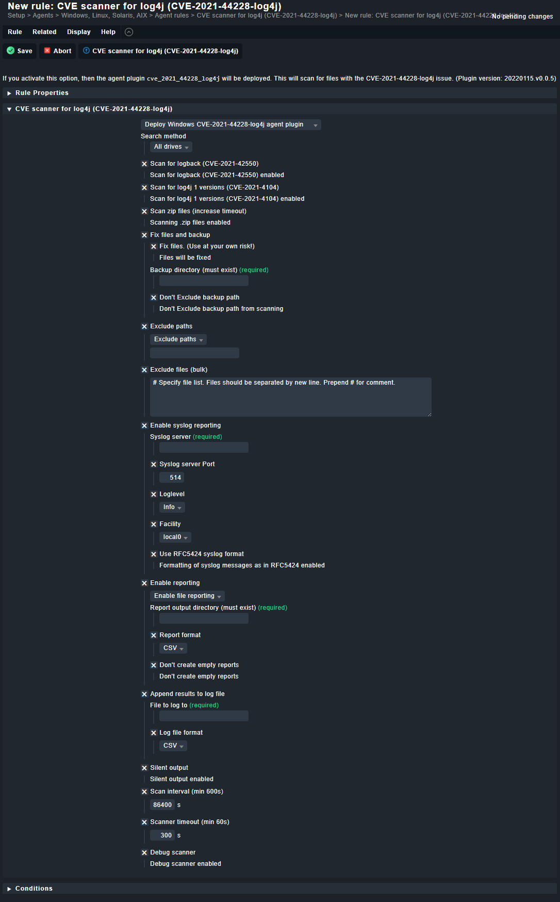

# CVE-2021-44228-log4j discovery [(Download the MKP package)](https://github.com/thl-cmk/CVE-log4j-check_mk-plugin/raw/master/cve_2021_44228_log4j.mkp  "Download MKP package")

### This plugin discovers vulnerable files for the CVE-2021-44228-log4j issue. To discover this files it uses the [CVE-2021-44228-Scanner from logpresso](https://github.com/logpresso/CVE-2021-44228-Scanner)

The scanner (and so the plugin) can discover the following log4j issues

- CVE-2021-44228
- [CVE-2021-4104](https://github.com/advisories/GHSA-fp5r-v3w9-4333)
- [CVE-2021-42550](https://github.com/advisories/GHSA-668q-qrv7-99fm)
- [CVE-2021-45105](https://github.com/advisories/GHSA-p6xc-xr62-6r2g)
- [CVE-2021-45046](https://github.com/advisories/GHSA-7rjr-3q55-vv33)
- [CVE-2021-44832 RCE](https://logging.apache.org/log4j/2.x/security.html)

**Note**: Included in this package is the scanner for Linux and Windows in version 2.7.1 (2022-01-02)

You will find the release notes/latest version for the logpresso scanner here [logpresso CVE-2021-44228-Scanner Releases](https://github.com/logpresso/CVE-2021-44228-Scanner/releases)

 **Note**: here you can [Download the MKP package for CMK 1.6](https://github.com/thl-cmk/CVE-log4j-check_mk-plugin/raw/master/cve_2021_44228_log4j_cmk16.mkp "Download MKP package for CMK 1.6"), this might not be always on the same level as the version for CMK 2.0.

**Note**: you will find always the latest version [here](https://thl-cmk.hopto.org/gitlab/checkmk/vendor-independent/cve_2021_44228_log4j)

To use this check you need to deploy the scanner and the plugin for your destination platform. You can do this via the agent bakery (_`Setup > Agents> Windows, Linux, Solaris, AIX > Agent rules > CVE-2021-44228-log4j`_). Here you can also configure some options for the scanner [(see WATO bakery)](doc/wato-bakery-linux.png "WATO bakery").

**Note**: only Linux and Windows is implemented for this bakery plugin. If you need this for AIX/Solaris have a look at the [contribution guidelines](CONTRIBUTING.md "Contributing")

**Note**: If you have created (baked) a new agent package you need to redeploy the agent (automatic update/software deployment)

If you have any issues or using the RAW edition of CMK or have a platform that is not supported by the bakery have a look at the [how to information](HOWTO.md "how to"). There you will also find some information whats going on under the hood.

---
Check Info:

* *service*: creates the service **CVE-2021-44228-log4j**
---
* *state*:\
    **critical**
    - if a (potentially) vulnerable file is found
    - if an error is found (from the agent plugin or the scanner)

    **warning**
    - if a file state is mitigated is found
    - if a file is skipped by the scanner
---
* *wato*: [(see WATO options)](doc/wato.png "see sample screenshot")
---
* *perfdata (if avilable)*: 
    * Vulnerable files
    * Potentially vulnerable files
    * Mitigated files
    * Files sskipped
    * Files scanned
    * Directories scanned
    * Run time
    * Errors (agent plugin or scanner)
---

#### Want to contribute?
Nice ;-) Have a look at the [contribution guidelines](CONTRIBUTING.md "Contributing")
---

Sample output

 
**Note**: in the service details you will find the raw output from the scanner

Sample output details

 

Sample syslog events in CMK event console

WATO options check plugin

WATO bakery Linux

WATO bakery Windows

